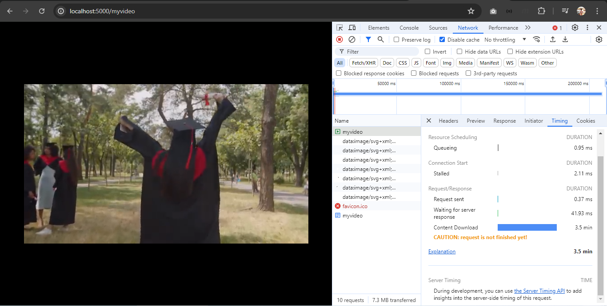

# Handy functions of `http`

## `http.MaxBytesReader`

When you need to set limit to the `POST` body size of an endpoint. For instance, in a file upload endpoint, you can use this function to set a limit on the size of file sent by a client.

### Signature

```go
func MaxBytesReader(w http.ResponseWriter, r io.ReadCloser, n int64) io.ReadCloser
```

### Usage scenario

```go
http.HandleFunc("/upload", func(w http.ResponseWriter, r *http.Request) {
  var fileSizeLimit int64 = 10

  r.Body = http.MaxBytesReader(w, r.Body, fileSizeLimit)

  defer r.Body.Close()

  data, err := io.ReadAll(r.Body)

  // incomplete read data
  fmt.Printf("%s\n", data)

  if err != nil {
   var mbe *http.MaxBytesError

   if errors.As(err, &mbe) {
    w.WriteHeader(http.StatusRequestEntityTooLarge)
    fmt.Fprintf(w, "File too large. Limit is %d bytes.\n", fileSizeLimit)
    return
   }
   w.WriteHeader(500)
   fmt.Fprintln(w, "Internal Server Error")
   return
  }

  fmt.Fprintln(w, "Upload success!")
})
```

### Test

This client tries to send a text file with more than ten ascii characters.

```bash
curl --data @tenpluschars.txt http://localhost:5000/upload
```

## `http.ServeContent`

This function, in one line, takes complete care of conditional or range request for a resource. You don't have to program for any conditional or range header specified in the request header, as this function takes care it all. All you have to do is hand-over the content that would normally be received from that endpoint.

This is particulary useful for media streaming. Media streaming services like YouTube and even the HTML `<video src=""></video>` element use Range Requests for media streaming. They request small portions of the content for early consumption.

This functions takes care of the neccessary status codes (200, 304, 206) and headers to be sent for both conditional and range requests.

### Signature

```go
func ServeContent(w http.ResponseWriter, req *http.Request, name string, modtime time.Time, content io.ReadSeeker)
```

### Usage scenario

```go
http.HandleFunc("/myfiles/note", func(w http.ResponseWriter, r *http.Request) {

  file, err := os.Open("note.md")
  if err != nil {
   fmt.Fprintln(os.Stderr, err)
   w.WriteHeader(500)
   fmt.Fprintln(w, "Internal Server Error")
   return
  }

  defer file.Close()

  fileStat, _ := file.Stat()

  http.ServeContent(w, r, fileStat.Name(), fileStat.ModTime(), file)
 })
```

Note that, our endpoint URL has nothing to do with the resource sent. Any endpoint URL can be specified. Any resource can be sent.

### Test

This client executes a conditional request based on last modified time (as usual). Our function then decides whether to serve the response or not.

The `bash` command below sends a conditional request, using the date specified in the request's `If-Modified-Since` header.

```bash
curl -z "Tue, 25 Jun 2024 17:00:00 GMT" http://localhost:5000/myfiles/notes.md
```

### Test 2

Try sending a video this time. Run in the browser an HTML file having a `video` element whose `src` points to the specified endpoint URL. Now inspect your network motitor. Notice in the header tab, how the browser uses range request headers to request for portions of the video data $-$ even when you seek forward and backward in the video. The `http.ServeContent` save you the stress of responding accordingly.

## `http.ServeFile`

A more concise version of `http.ServeContent`, with the following differences:

- It treats a URL path ending in `/index.html` specially by redirecting to the path without `/index.html`. It assumes an `index.html` file wants to be served (and most implementations hide the ending `/index.html` in these situation). That said, like `http.ServeContent` the resource served has nothing to do with the endpoint URL specified. Any type of resource can be served, even in this case.
- It is best for serving files from the file system $-$ one line and we're done. `http.ServeContent`, however, allows serving any type that implements the `io.ReadSeeker` interface. It doesn't have to be a file from the file system. `http.ServeContent` is therefore, more flexible.

### Signature

```go
func ServeFile(w http.ResponseWriter, r *http.Request, name string)
```

### Usage scenario

```go
http.HandleFunc("/myfiles/note", func(w http.ResponseWriter, r *http.Request) {
  http.ServeFile(w, r, "/path/to/file")
})
```

## `http.FileServer`

What do you ("john" - for example) think happens when you deploy your `build` folder on hosting sites like Netlify.

In the remote server file system, a folder (`john_website` - for instance) containing the contents of your `build` folder (if not, actually, your build folder) is directly pointed to by your domain's root path.

Precisely, the handler that hanldes the request to your domain is this `http.FileServer` (or equivalent function in other languages). It, basically, treats your website folder as a single file system.

### Signature

```go
func FileServer(root http.FileSystem) http.Handler
```

### Usage scenario

Say, your build folder contained the usual `index.html`, accompanied by sub-page folders, CSS and JavaScript files/folders $-$ the usual thing. On deployment the contents have now being transferred to a `{username}_website` folder.

```go
johnWebFS := http.Dir("/computer/netlify/websites/john_wesbite")

http.ListenAndServe("funcoding.netlify.app", http.FileServer(johnWebFS))
```

Yeah, Of course! One line, and your website is up and running.

> That's just for my explanation, of course, you should change the parameters if you're trying this out

```go
myWebFS := http.Dir("path/to/website/folder")

http.ListenAndServe("localhost:5000", http.FileServer(myWebFS))
```

### Test

The usual website browsing. Just goto `https://funcoding.netlify.app`. Actually, `http://localhost:5000` in our case.

## `(http.ResponseWriter).Write()`

The famous `Write()` method??? Who doesn't know what that does?

Yeah, we all know what it does. But what it really does and how it does it is what's intriguing.

This `Write()` method actually "streams" data to the client "in chunks" and sets `Transfer-Encoding: "chunked"` header. It doesn't transfer whole data to the client at once. A 1gb video data is contained in a byte slice, for instance, will sent it in chunks. If you inspect the network monitor in your browser, you'll see a *"CAUTION: request is not finished yet!"* warning, and you'll notice the amount of data transfered shown (look bottom-left) is far from 1gb. In fact, pausing the video also pauses the data transfer.

This original size of this video below is 26.7mb. The amount of data transfer below is just 7.3mb.



Another interesting behaviour is that, you can queue more `Write([]byte)` methods anywhere before the handler returns and the data in the byte slice will be pushed to the buffer, after the previous content pushed by previous `Write([]byte)` calls have been flushed to the client. Until our handler returns, the browser network monitor will still display *"CAUTION: request is not finished yet!"* in between the calls to `Write([]byte)`. It is, however, important to note that additional `Write([]byte)` calls will assume the `Content-Type` of the first.

Consider this demonstration below:

```go
http.HandleFunc("/mynotes", func(w http.ResponseWriter, r *http.Request) {
  notes, err := os.ReadFile("notes.md")
  if err != nil {
   w.WriteHeader(500)
   fmt.Fprintln(w, "Error reading file:", err)
   return
  }

  w.Write(notes)

  // the browser network motitor will still display, "CAUTION: request is not finished yet!"
  time.Sleep(3 * time.Second)

  html, err := os.ReadFile("website/index.html")
  if err != nil {
    w.WriteHeader(500)
   fmt.Fprintln(w, "Error reading file:", err)
   return
  }
  w.Write([]byte("\n❤❤❤❤❤❤❤❤❤❤❤❤❤❤❤\n\n"))

  // this will be treated as text/plain, not text/html
  w.Write(html)

 })
```

## Form handling

### `(http.Request).ParseMultipartForm`

Before we can start getting form values and files from our request, first we must parse them from the request body.

This request method parses the body, up to the size specified in `maxMemory`, into memory (containing usable data). The remaining data beyond `maxMemory` is stored on disk (unsuable).

#### Signature

```go
func (r *http.Request) ParseMultipartForm(maxMemory int64) error
```

Note that, the `maxMemory` specified isn't intend to set the body read limit. If you want to set the body read limit, thereby allowing this function to return error when body read limit is reached, you have to use `http.MaxBytesReader(r.Body)` like we discussed above.

#### Usage

```go
// set r.Body
http.HandleFunc("/profile", func(w http.ResponseWriter, r *http.Request) {
  limit := 100 // 100 bytes.
  // Practically, use an estimate of the allowed maximum file size (sum of, if multiple) plus the size of other form data

  r.Body = http.MaxBytesReader(w, r, limit) // advisable

  err := r.ParseMultipartForm(limit) // Of course, why allocate more than body read limit
  // if body read limit is reached while parsing, this error would be: "http: request body too large"
})
```

After parsing the form successfully, request properties and methods that provide access to form data will now contain the parsed form data. Lets take a look into these properties and methods.

### `(http.Request).FormValue`

For a non-file type form field, this function gets the first of `n` value associated with the given key.

A file type form field is treated as non-existent.

#### Signature

```go
func (*http.Request) FormValue(key string) string
```

#### Usage

```go
http.HandleFunc("/profile", func(w http.ResponseWriter, r *http.Request) {
  r.ParseMultipartForm(maxMemory)

  uname := r.FormValue("username")

  fmt.Println(uname) // i9 (as tested below)
})
```

#### Test

```bash
curl --form username=i9 age=23 http:localhost:5000/profile
```

### `(http.Request).Form`

The `Form` object of request has an underlying `map[string][]string` that is populated with "non-file type" form fields of the parsed form. Form fields of type "file" are excluded from the map.

It exposes methods to access and modify the form (in case of a client request). The only method we'll need in our case is the `Get()` method, which returns the first of `n` values associated with the given key.

Another way is to iterate over `key=[values...]` pair of the underlying map. This way you can get all the values associated with a key.

#### Usage

```go
http.HandleFunc("/profile", func(w http.ResponseWriter, r *http.Request) {
  err := r.ParseMultipartForm(maxMemory)
  // handle error appropriately

  age := r.Form.Get("age")
  fmt.Println(age) // 23 (as tested below)

  // iterate over the map
  for key, values := range r.Form {
    fmt.Printf("%s: %s\n", key, value[0])
  }
})
```

#### Test

```bash
curl --form username=i9 age=23 http:localhost:5000/profile
```

### `(http.Request).FormFile`

For a form field of type "file", this function gets the first of `n` files associated with the specified key.

A non-file type form field is treated as non-existent.

#### Signature

```go
func (*http.Request) FormFile(key string) (multipart.File, *multipart.FileHeader, error)
```

The `multipart.File` implements the Reader interface, which means we can read the data with functions like `io.ReadAll()`. The `*multipart.FileHeader` allows us to read the file properties like filename, size, and header. It also has an `Open()` method that returns the same `multipart.File`.

#### Usage

```go
http.HandleFunc("/profile", func(w http.ResponseWriter, r *http.Request) {
  err := r.ParseMultipartForm(maxMemory)
  // handle error appropriately

  f, fh, _ := r.FormFile("pic")

  defer f.Close()

  fmt.Println(fh.Filename, fh.Header.Get("Content-Type"))

  data, _ := io.ReadAll(f)

  os.WriteFile("path/to/storage/"+fh.filename, data, os.ModePerm) // keep in file system
})
```

#### Test

```bash
curl --form pic=@mypic.png username=i9 age=23 http:localhost:5000/profile
```

### `(http.Request).MultipartForm

The request's `MultipartForm` object has

- a `File` object with an underlying `map[string][]*multipart.FileHeader` type, and
- a `Value` object with an underlying `map[string][]string` type

However, you only access values directly from the map, there are no methods exposed.

#### Usage

```go
http.HandleFunc("/profile", func(w http.ResponseWriter, r *http.Request) {
  err := r.ParseMultipartForm(maxMemory)
  // handle error appropriately

  filehs := r.MultipartForm.File["pic"]
  for _, fileh := range filehs {
    file, _ := fileh.Open()

    defer file.Close()

    data, _ := io.ReadAll(file)
    // use data
  }

  for key, filehs := range r.MultipartForm.File {
    for _, fileh := range filehs {
      file, _ := fileh.Open()
  
      defer file.Close()
  
      data, _ := io.ReadAll(file)
      // use data
    }
  }

  name := r.MultipartForm.Value["name"][0]

  for key, values := range r.MultipartForm.Value {
    name := values[0]
  }
})
```

#### Test

```bash
curl --form pic=@mypic.png username=i9 age=23 http:localhost:5000/profile
```
